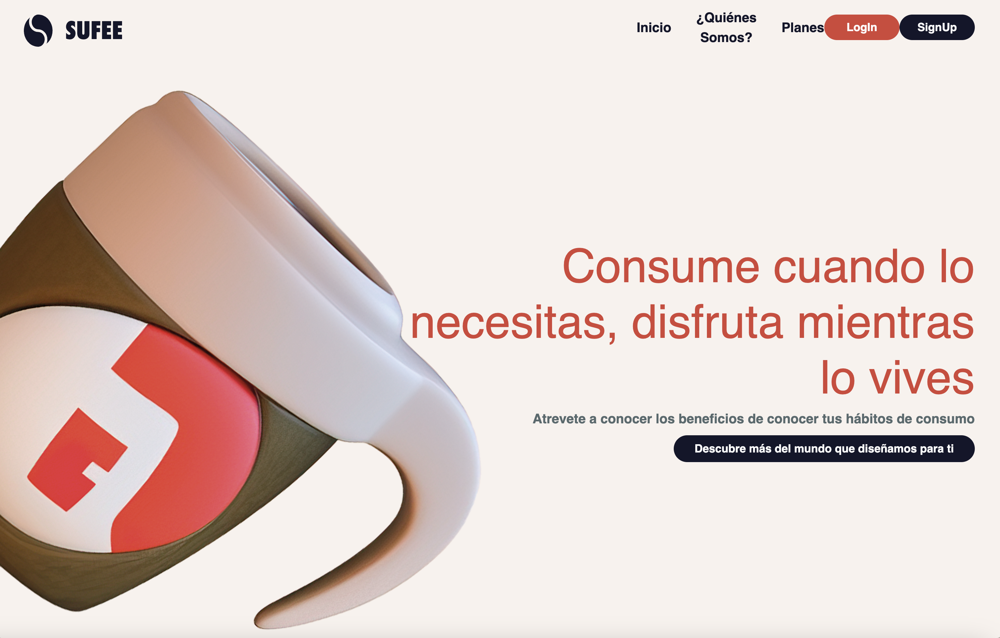

# SUFFE



# Nolberto Castro Sánchez

A01641501

## Descripción:

Sufee es una compañia la cual se dedica a la venta de maquinas y productos de la industria cafetera, uno puede pedir a mayoreo uno de sus productos en linea iniciando sesión.

El `HTML, CSS y el JS` son aplicados en el index.html, para el `CSS` use un framework llamado `Sass` y el javascript esta hasta abajo del archivo `index.html`

Funcionalidad de Bootstrap y JQuery: El bootstrap es aplicado en un boton en una parte de la pagina la cual muestra una alerta, y el `JQuery` se utiliza a la hora de darle click al boton de hasta arriba de “Descubre más del mundo que diseñamos para ti” para cambiar de una pagina al menu de logIn.

El `AJAX` es utilizado en la parte de quienes somos al dar click en el boton de traductir el cual cambia el texto original a un texto traducido en ingles.

## NPM

Para el proyecto utilizamos diferentes frameworks, por lo que tendremos que tener NPM installado además de node.js

Para correr el proyecto desde la terminarl podemos usar el siguiente comando:

```bash
npm start
```

## Muchas Gracias